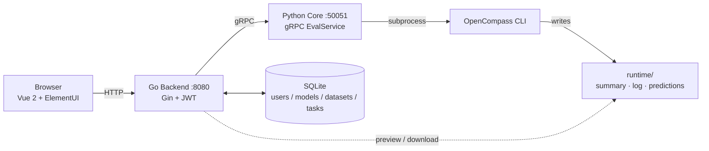
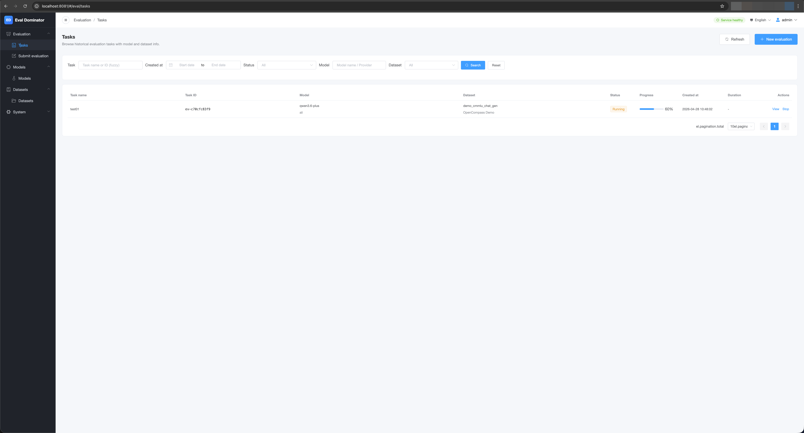
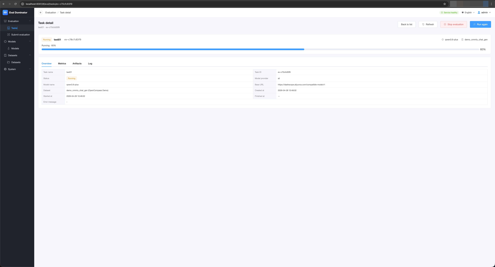
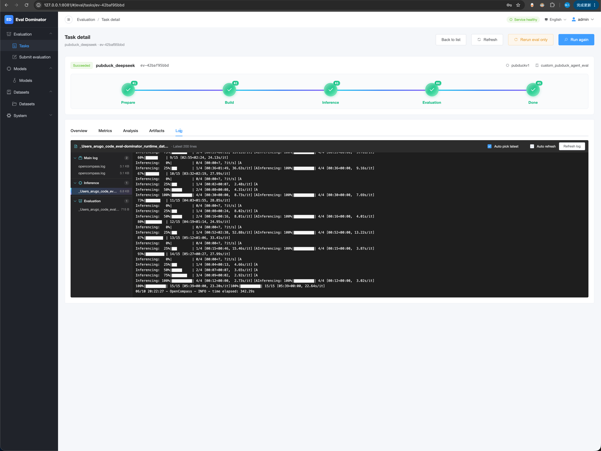
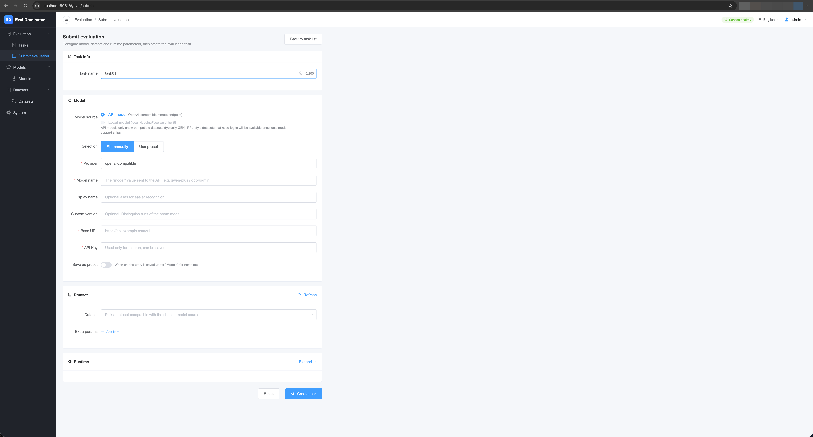
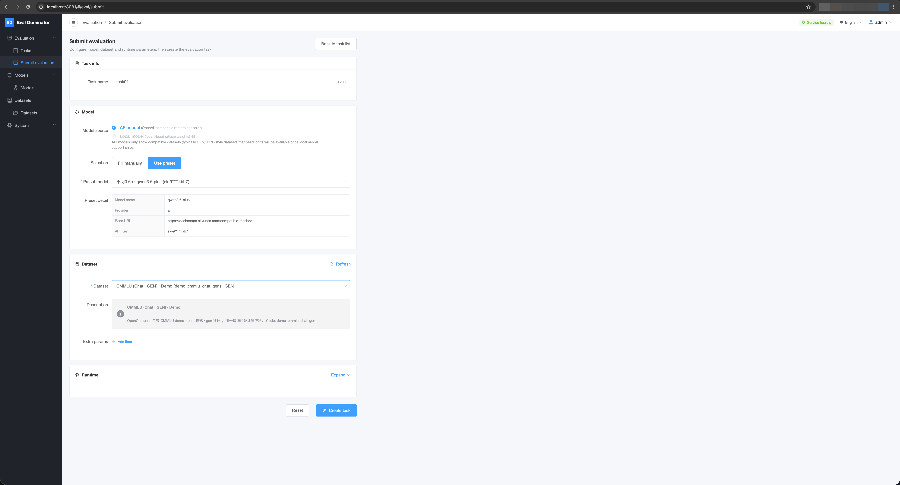
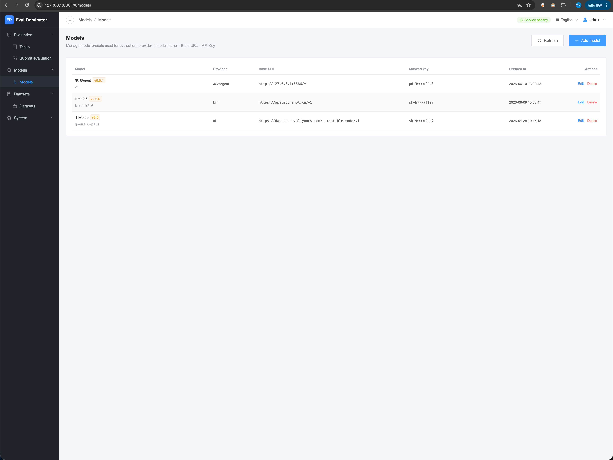

<p align="center">
  
</p>

<h1 align="center">Eval Dominator</h1>

<p align="center">
  A lightweight, local-first web playground that wraps<br/>
  <a href="https://github.com/open-compass/opencompass">OpenCompass</a> into something you can drive from a browser.
</p>

<p align="center">
  
  
  <a href="https://github.com/open-compass/opencompass"></a>
  <a href="./LICENSE"></a>
  <br/>
  
  
  
  
  
  
  
  
</p>

<p align="center">
  <a href="./README.md">中文</a> · <a href="./README.en.md">English</a>
</p>

> **Status: MVP (v0.1.0-mvp), actively iterating.** Designed for single-machine, single-user usage at the moment. Not hardened for public deployment.

## What it is

Three layers, talking to each other through stable contracts:

- **Frontend** — Vue 2 + ElementUI: login, submit jobs, follow progress, browse metrics & artifacts.
- **Backend** — Go + Gin + SQLite: accounts, task orchestration, persistence, REST API.
- **Core** — Python + gRPC + OpenCompass: actually drives OpenCompass via subprocess; called by the backend over gRPC.



## Screenshots

<table>
  <tr>
    <td width="33%" align="center">
      <a href="./eval-img/en/task-list.png"></a>
      <br/><sub><b>Task list</b><br/>create · search · filter</sub>
    </td>
    <td width="33%" align="center">
      <a href="./eval-img/en/task-detail01.png"></a>
      <br/><sub><b>Task detail</b><br/>stage progress · metrics · artifacts</sub>
    </td>
    <td width="33%" align="center">
      <a href="./eval-img/en/task-detail-log.png"></a>
      <br/><sub><b>Live log</b><br/>auto-tails the freshest infer subset</sub>
    </td>
  </tr>
  <tr>
    <td width="33%" align="center">
      <a href="./eval-img/en/submit.png"></a>
      <br/><sub><b>Submit · model</b><br/>API / local · presets</sub>
    </td>
    <td width="33%" align="center">
      <a href="./eval-img/en/submit02.png"></a>
      <br/><sub><b>Submit · dataset</b><br/>GEN / PPL · runtime params</sub>
    </td>
    <td width="33%" align="center">
      <a href="./eval-img/en/model.png"></a>
      <br/><sub><b>Models</b><br/>OpenAI-compatible presets · masked keys</sub>
    </td>
  </tr>
</table>

## What works (MVP)

- ✅ Username + password (bcrypt) + JWT login; a default account `admin / admin123` is seeded on first start — change it via `POST /auth/change-password` immediately
- ✅ Evaluation against any OpenAI-compatible remote API (DashScope / OpenAI / DeepSeek / self-hosted vLLM …)
- ✅ Saved model presets, with masked API key on display
- ✅ Dataset center: auto-syncs OpenCompass demos (`demo_gsm8k`, `demo_math`, `demo_cmmlu`, …), tags `gen` / `ppl` and blocks incompatible combos
- ✅ Task list: search by name/ID, filter by date range / status / dataset
- ✅ Task detail: stage progress, metrics with auto percent rendering, artifact preview & download, live log that always tails the freshest infer log
- ✅ Cancel a task (SIGTERM/SIGKILL on the whole OpenCompass process group)
- ✅ Frontend i18n (中文 / English): vue-i18n + ElementUI locale; all strings live under `frontend/src/locales/{zh-CN,en-US}/*.json`. Adding a new locale is one entry in the registry.
- 🚧 Eval roles & templates (multi-model + judge orchestration; design in [`md/评测角色与模板规划-2026-04-27-v1.md`](./md/评测角色与模板规划-2026-04-27-v1.md))
- 🚧 Local HuggingFace models + PPL datasets
- 🚧 Real user system, RBAC, multi-tenant

## Built on top of OpenCompass

`opencompass==0.5.2`, installed inside `core/.venv` so it never collides with your system Python.

> The integration surface is intentionally small: we generate an mmengine `.py` config that OpenCompass consumes, run its CLI as a subprocess, then parse `summary/*.csv` for metrics. Bumping OpenCompass within the 0.5.x line should be a drop-in. If upstream changes how demo dataset variables are exposed, you may need to tweak the two regexes in `core/src/opencompass_core/adapter/opencompass_adapter.py`.

## Quick Start

### 0. Prerequisites

| Tool | Version | Used for |
| --- | --- | --- |
| Python | **3.10** (do not use 3.11+, OpenCompass 0.5.x is not officially supported there) | Core / OpenCompass |
| Go | 1.21+ | Backend |
| Node.js | 18+ | Frontend |
| protoc toolchain | auto-installed by `scripts/generate_proto.sh` | gRPC code generation |

### 1. Clone & make local config

```bash
git clone <your-fork-url> eval-dominator
cd eval-dominator

cp backend/config/config.example.yaml backend/config/config.yaml
cp core/config/config.example.yaml    core/config/config.yaml
cp frontend/.env.development.example  frontend/.env.development  # if needed
```

> Replace `jwt.secret` in `backend/config/config.yaml` with something only you know. Do not ship the placeholder.

### 2. Bootstrap the Python venv (with OpenCompass)

```bash
./scripts/init_core_venv.sh
```

This creates `core/.venv` and installs OpenCompass 0.5.2 plus runtime deps. First run takes a while.

### 3. Generate gRPC code (first time and after editing proto)

```bash
./scripts/generate_proto.sh
```

It will `go install` `buf` / `protoc-gen-go` / `protoc-gen-go-grpc` if missing, and use the venv's `grpcio-tools` for the Python side.

### 4. Three terminals

```bash
# Terminal 1
./scripts/start_core.sh        # gRPC :50051

# Terminal 2
./scripts/start_backend.sh     # HTTP :8080

# Terminal 3
./scripts/start_frontend.sh    # Vue dev server :8081/8080
```

Open the frontend URL and log in with the seeded account **`admin / admin123`**. Change it right after the first login:

```bash
curl -X POST http://127.0.0.1:8080/api/auth/change-password \
  -H "Authorization: Bearer <token>" \
  -H "Content-Type: application/json" \
  -d '{"oldPassword":"admin123","newPassword":"<your new password>"}'
```

Existing accounts are never overwritten on restart, so editing `auth.default_admin_password` in `config.yaml` only affects fresh databases.

### 5. Run your first evaluation

1. **Models** → add a preset. Example: DashScope `qwen-plus`, base URL `https://dashscope.aliyuncs.com/compatible-mode/v1`, paste your `sk-...` API key.
2. **Datasets** lists every OpenCompass demo found locally. Start with **`demo_gsm8k_chat_gen`** (only 4 prompts, ~30 seconds). Avoid `demo_cmmlu_chat_gen` for the first run — it expands into 67 subjects (~30 minutes).
3. **Submit Eval** → pick the preset model + dataset → create.

The detail page surfaces: stage progress bar, live log (auto-tailing the freshest infer subset), metric table (with auto percent detection and bar rendering), and artifact preview/download.

## Project layout

```
.
├── frontend/             # Vue 2 + ElementUI
├── backend/              # Go + Gin
│   ├── cmd/server/
│   ├── internal/{config,domain,application,handler,middleware,server,infrastructure}
│   ├── migrations/       # SQLite bootstrap
│   └── docs/             # http接口文档.md / 数据库设计.md
├── core/                 # Python gRPC service
│   ├── src/opencompass_core/
│   ├── config/           # config.example.yaml
│   └── scripts/          # generate_proto.py
├── proto/                # gRPC contract
├── runtime/              # Local SQLite + eval artifacts (gitignored)
├── md/                   # Chinese design docs (arch / steps / specs / role plan)
├── scripts/              # Bootstrap / start / generate proto
└── deploy/               # Local deployment notes
```

## Docs

- Architecture: [`md/整体架构说明-2026-04-27-v1.md`](./md/整体架构说明-2026-04-27-v1.md)
- Implementation steps: [`md/实施步骤-2026-04-27-v1.md`](./md/实施步骤-2026-04-27-v1.md)
- Naming / API conventions: [`md/命名与接口规范-2026-04-27-v1.md`](./md/命名与接口规范-2026-04-27-v1.md)
- Eval role / template plan: [`md/评测角色与模板规划-2026-04-27-v1.md`](./md/评测角色与模板规划-2026-04-27-v1.md)
- HTTP API: [`backend/docs/http接口文档.md`](./backend/docs/http接口文档.md)
- gRPC contract: [`proto/评测服务协议.md`](./proto/评测服务协议.md)
- Database: [`backend/docs/数据库设计.md`](./backend/docs/数据库设计.md)
- Local deployment: [`deploy/本地部署说明.md`](./deploy/本地部署说明.md)

## Runtime gotchas worth knowing (already baked into the start scripts)

- `HF_HUB_OFFLINE=1` / `TRANSFORMERS_OFFLINE=1`: keeps OpenCompass from probing huggingface.co for the remote model name (it is not a real HF repo). Without this, every subset eats a 50 s HF rate-limit retry.
- `GRPC_ENABLE_FORK_SUPPORT=0` / `GRPC_VERBOSITY=error`: Core is a gRPC server; subprocess fork+exec for OpenCompass with fork-support enabled aborts the child on macOS.
- DashScope's OpenAI-compatible mode strictly requires `temperature` to be a float, so the generated `OpenAISDK` config defaults to `temperature=0.0`. Override it via the task's `params` map if needed.
- Defaults for the OpenAISDK block: `query_per_second=5`, `max_workers=8`. Reasonable for most OpenAI-compatible vendors.

## Security notes

- ⚠️ The default JWT secret is the placeholder `replace-with-local-secret`. Replace it before any deployment (e.g. `openssl rand -hex 32`).
- ⚠️ The default admin password `admin123` is just a seed for first-run convenience. Never expose it on the public internet.
- ⚠️ API keys are stored in plaintext in SQLite; only the masked form is returned to the UI.
- ⚠️ Artifact preview/download endpoints validate that paths sit under `runtime/`, but the backend is still meant for localhost.

## Roadmap (rough)

- [ ] Self-service user registration, multi-tenant
- [ ] Eval roles / templates (see plan doc)
- [ ] Local HuggingFace models + PPL datasets
- [ ] Concurrent task scheduling
- [ ] Multi-user + workspace isolation

## Acknowledgements & Citation

This project is built on top of [OpenCompass 0.5.2](https://github.com/open-compass/opencompass). Huge thanks to the OpenCompass team for the solid evaluation pipeline and dataset coverage.

- Repository: <https://github.com/open-compass/opencompass>
- Docs: <https://opencompass.readthedocs.io/>

If you publish numbers produced by this project, please also cite OpenCompass:

```bibtex
@misc{2023opencompass,
  title        = {OpenCompass: A Universal Evaluation Platform for Foundation Models},
  author       = {OpenCompass Contributors},
  howpublished = {\url{https://github.com/open-compass/opencompass}},
  year         = {2023}
}
```

## License

[MIT](./LICENSE)
