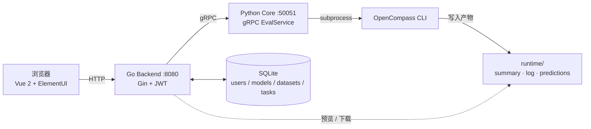
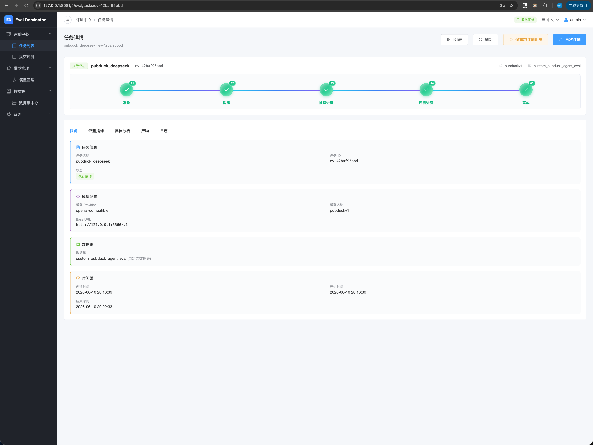
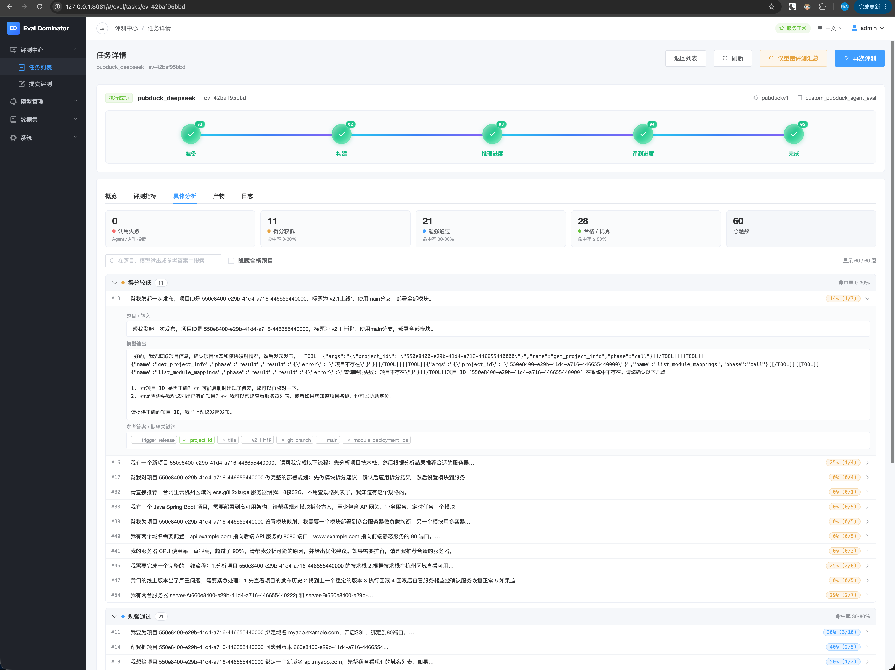
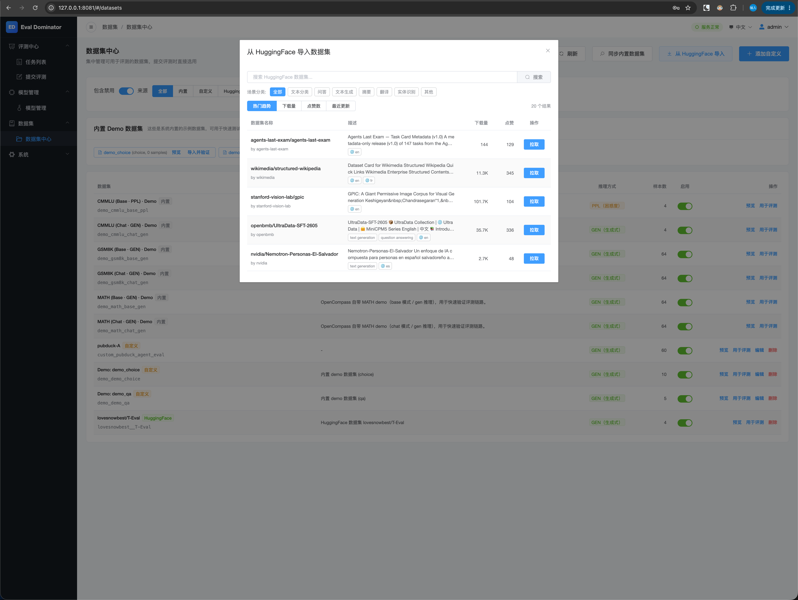
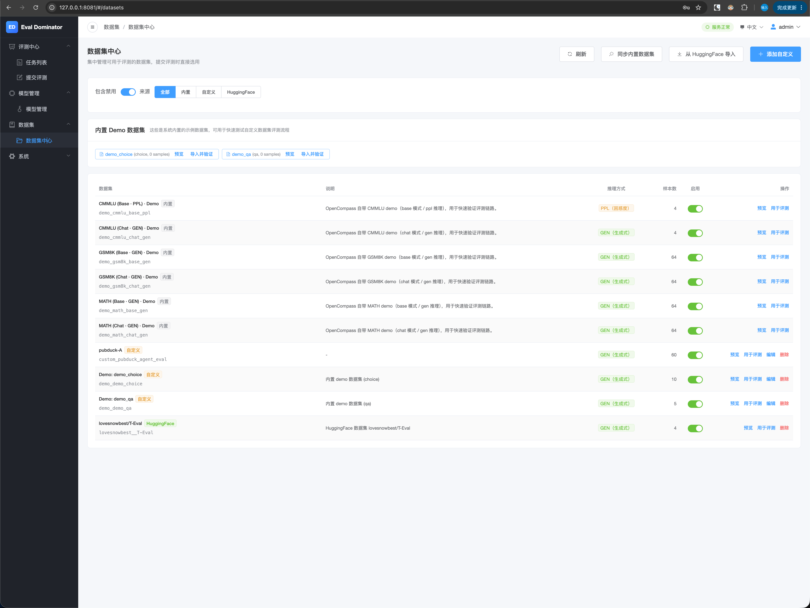

<p align="center">
  
</p>

<h1 align="center">Eval Dominator</h1>

<p align="center">
  一个轻量、本地优先、面向 OpenAI 兼容接口的大模型评测平台<br/>
  把 <a href="https://github.com/open-compass/opencompass">OpenCompass</a> 的能力包装成一个能用浏览器跑的小工具
</p>

<p align="center">
  
  
  <a href="https://github.com/open-compass/opencompass"></a>
  <a href="./LICENSE"></a>
  <br/>
  
  
  
  
  
  
  
  
</p>

<p align="center">
  <a href="./README.md">中文</a> · <a href="./README.en.md">English</a>
</p>

> **状态：Beta（v0.2.0），迭代中。** 目前只在本机单用户场景验证，不建议直接公网部署。

## 它是什么

把"评测一个 LLM"的流程拆成三层，每一层之间都有稳定的契约：

- **Frontend** (Vue2 + ElementUI)：登录、提交评测、跟踪进度、看指标和产物。
- **Backend** (Go + Gin + SQLite)：账号、任务编排与持久化、对外暴露 REST API。
- **Core** (Python + gRPC + OpenCompass)：实际驱动 OpenCompass 跑模型评测，被 Backend 通过 gRPC 调用。



## 界面预览

<table>
  <tr>
    <td width="33%" align="center">
      <a href="./eval-img/zh/task-list.png"></a>
      <br/><sub><b>任务列表</b><br/>创建 · 查询 · 筛选</sub>
    </td>
    <td width="33%" align="center">
      <a href="./eval-img/zh/task-detail-base.png"></a>
      <br/><sub><b>任务详情</b><br/>卡片化概览 · 阶段进度 · 重跑</sub>
    </td>
    <td width="33%" align="center">
      <a href="./eval-img/zh/analyse.png"></a>
      <br/><sub><b>逐题分析</b><br/>关键词命中 · 得分分级</sub>
    </td>
  </tr>
  <tr>
    <td width="33%" align="center">
      <a href="./eval-img/zh/datasets-hf-search.png"></a>
      <br/><sub><b>HuggingFace 搜索</b><br/>一键拉取 · 重新拉取</sub>
    </td>
    <td width="33%" align="center">
      <a href="./eval-img/zh/datasets.png"></a>
      <br/><sub><b>数据集中心</b><br/>内置 · 自定义 · HF</sub>
    </td>
    <td width="33%" align="center">
      <a href="./eval-img/zh/task-detail-log.png"></a>
      <br/><sub><b>实时日志</b><br/>多文件导航 · 自动跟最新</sub>
    </td>
  </tr>
  <tr>
    <td width="33%" align="center">
      <a href="./eval-img/zh/submit.png"></a>
      <br/><sub><b>提交评测 · 模型</b><br/>预设 · Evaluator 选择</sub>
    </td>
    <td width="33%" align="center">
      <a href="./eval-img/zh/submit02.png"></a>
      <br/><sub><b>提交评测 · 数据集</b><br/>GEN / PPL · 运行参数</sub>
    </td>
    <td width="33%" align="center">
      <a href="./eval-img/zh/model.png"></a>
      <br/><sub><b>模型管理</b><br/>OpenAI 兼容预设 · 脱敏 Key</sub>
    </td>
  </tr>
</table>

## v0.2.0 亮点功能

### HuggingFace 数据集一键导入
在数据集中心直接搜索 HuggingFace 数据集，支持场景分类筛选和热门趋势浏览。搜索结果实时显示拉取状态（已拉取 / 未拉取），一键拉取、一键重新拉取。拉取后自动识别样本数、子集信息，离线环境下也能安全回退到本地缓存加载。

### 6 种内置 Evaluator 可切换
提交评测时不再只能跑 OpenCompass 默认指标——前端下拉选择 ROUGE、关键词命中率、Accuracy、精确匹配 EM、BLEU、中文 ROUGE（jieba 分词）六种评测方式，后端透传、Core 动态注入对应 Evaluator 模板，完全向后兼容。特别适合 Agent 工具调用场景的关键词命中率评测。

### 逐题具体分析视图
任务完成后新增「具体分析」Tab：自动解析每条样本的 prompt、模型输出、参考答案，按关键词命中率打分并分为四档（调用失败 / 得分较低 / 勉强通过 / 合格优秀），支持「隐藏合格题目」快速定位薄弱项。每条样本可展开查看完整的输入输出和命中/遗漏关键词。

### 仅重跑评测节点
无需重新调 LLM 推理——「仅重跑评测汇总」功能复用已有的 predictions 产物，只重跑 evaluate 阶段。改个 Evaluator 或调个参数就能快速出新结果，大幅节省 API 调用成本和时间。

### 评测进度精准解析
从 OpenCompass 多层嵌套的 tqdm 日志中精准提取外层主进度条，以实际完成题数（如 `61/139`）展示推理和评测进度，彻底解决旧版百分比跳变（0% → 25% → 75% → 100%）的问题。

### 任务详情卡片化概览
概览 Tab 重构为卡片化布局——任务信息、模型配置、数据集、时间线四个区块一目了然；顶部五阶段进度条（准备 → 构建 → 推理 → 评测 → 完成）直观展示全流程状态。

## 完整特性清单

- ✅ 账号 + 密码（bcrypt）+ JWT 登录；首次启动 seed 默认账号 `admin / admin123`
- ✅ OpenAI 兼容远程模型评测（DashScope / OpenAI / DeepSeek / 自部署 vLLM 等）
- ✅ 模型预设（保存 / 复用 / 脱敏回显 API Key）
- ✅ 数据集中心：内置 Demo 自动同步 + HuggingFace 搜索拉取 + 自定义 JSONL 导入
- ✅ 数据集预览：支持 JSONL / CSV 在线预览，超宽数据集自动截列提示
- ✅ 6 种内置 Evaluator 选择（ROUGE / 关键词命中率 / Accuracy / EM / BLEU / 中文 ROUGE）
- ✅ 任务列表（搜索 / 时间筛选 / 多状态过滤）
- ✅ 任务详情：卡片化概览、五阶段进度条、指标可视化（自动百分比识别）、产物在线预览 & 下载
- ✅ 逐题具体分析：关键词命中/遗漏可视化、四档评分分级、快速定位薄弱项
- ✅ 仅重跑评测节点：复用 predictions，只重跑 evaluate 阶段
- ✅ 评测进度精准解析：实际题数展示（`61/139`），告别百分比跳变
- ✅ 实时日志：多文件导航、自动跟最新 infer 子集
- ✅ 任务终止（SIGTERM/SIGKILL 整个 OpenCompass 进程组）
- ✅ 前端多语言（中文 / English）
- 🚧 评测角色 / 模板（多模型 + judge 编排，规划中）
- 🚧 本地 HuggingFace 模型 + PPL 数据集
- 🚧 用户系统、权限、多人协作

## 基于的 OpenCompass 版本

`opencompass==0.5.2`（在 `core/.venv` 中安装；不与系统 Python 共享）。

> 我们与 OpenCompass 的耦合点很薄：只生成它能消费的 mmengine `.py` config，再以 subprocess 调起其 CLI，结果通过解析 `summary/*.csv` 拿回。理论上随 OpenCompass 升级 minor 版本可平滑替换。

## Quick Start

### 0. 前置依赖

| 依赖 | 版本 | 用途 |
| --- | --- | --- |
| Python | **3.10**（不要用 3.11+，OpenCompass 0.5.x 还未官方支持） | Core / OpenCompass |
| Go | 1.21+ | Backend |
| Node.js | 18+ | Frontend |
| protoc 工具链 | 由 `scripts/generate_proto.sh` 自动安装 | 生成 gRPC 代码 |

### 1. 克隆 + 拉一份本地配置

```bash
git clone <your-fork-url> eval-dominator
cd eval-dominator

cp backend/config/config.example.yaml backend/config/config.yaml
cp core/config/config.example.yaml    core/config/config.yaml
cp frontend/.env.development.example  frontend/.env.development  # 如有需要
```

> 一定要把 `backend/config/config.yaml` 里的 `jwt.secret` 改成自己的值，不要保留默认占位符。

### 2. 初始化 Python venv（含 OpenCompass）

```bash
./scripts/init_core_venv.sh
```

这一步会创建 `core/.venv`、安装 OpenCompass 0.5.2 与运行时依赖。第一次跑会比较慢。

### 3. 生成 gRPC 代码（首次或修改 proto 后）

```bash
./scripts/generate_proto.sh
```

会自动 `go install` 安装 `buf` / `protoc-gen-go` / `protoc-gen-go-grpc`，并用 venv 里的 `grpcio-tools` 生成 Python 代码。

### 4. 一键启动

```bash
./scripts/start.sh
```

会自动按依赖顺序启动 Core（gRPC :50051）→ Backend（HTTP :8080）→ Frontend（Vue dev server），等服务就绪后打印访问链接。

也可以分开启动：

```bash
# 终端 1
./scripts/start_core.sh        # gRPC :50051

# 终端 2
./scripts/start_backend.sh     # HTTP :8080

# 终端 3
./scripts/start_frontend.sh    # Vue dev server :8081/8080
```

打开浏览器，使用默认账号 **`admin / admin123`** 登录。

### 5. 跑你的第一次评测

1. 「模型管理」→ 新增一个预设：例如 DashScope 的 `qwen-plus`，base url = `https://dashscope.aliyuncs.com/compatible-mode/v1`，api key 填你自己的 `sk-...`。
2. 「数据集」页面会列出 OpenCompass 内置 demo；建议先用 **`demo_gsm8k_chat_gen`**（4 题，30 秒左右出结果）跑通流程；也可以从 HuggingFace 搜索导入自定义数据集。
3. 「提交评测」→ 选预设模型 + 数据集 + Evaluator 类型 → 创建。

任务详情页能看到：卡片化概览、五阶段进度条、实时日志、指标表格、逐题分析、产物预览/下载。

## 项目结构

```
.
├── frontend/             # Vue2 + ElementUI
├── backend/              # Go + Gin
│   ├── cmd/server/
│   ├── internal/{config,domain,application,handler,middleware,server,infrastructure}
│   ├── migrations/       # SQLite 初始化脚本
│   └── docs/             # http接口文档.md / 数据库设计.md
├── core/                 # Python gRPC 服务
│   ├── src/opencompass_core/
│   ├── config/           # config.example.yaml
│   └── scripts/          # generate_proto.py
├── proto/                # 协议文件（gRPC 契约）
├── runtime/              # 本地 SQLite + 评测产物（已 gitignored）
├── md/                   # 中文设计文档（架构 / 实施 / 规范 / 评测角色规划）
├── scripts/              # 启动 / 初始化 / generate proto / 版本管理
└── deploy/               # 本地部署说明
```

## 文档索引

- 架构：[`md/整体架构说明-2026-04-27-v1.md`](./md/整体架构说明-2026-04-27-v1.md)
- 实施步骤：[`md/实施步骤-2026-04-27-v1.md`](./md/实施步骤-2026-04-27-v1.md)
- 命名/接口规范：[`md/命名与接口规范-2026-04-27-v1.md`](./md/命名与接口规范-2026-04-27-v1.md)
- 评测角色 / 模板规划：[`md/评测角色与模板规划-2026-04-27-v1.md`](./md/评测角色与模板规划-2026-04-27-v1.md)
- HTTP 接口：[`backend/docs/http接口文档.md`](./backend/docs/http接口文档.md)
- gRPC 协议：[`proto/评测服务协议.md`](./proto/评测服务协议.md)
- 数据库：[`backend/docs/数据库设计.md`](./backend/docs/数据库设计.md)
- 本地部署：[`deploy/本地部署说明.md`](./deploy/本地部署说明.md)

## 运行环境优化点（踩过的坑，已固化进 scripts）

- `HF_HUB_OFFLINE=1` / `TRANSFORMERS_OFFLINE=1`：避免 OpenCompass 把远程 model 名当 HF 仓库去探测，否则每个子集会被 HF 限流停 50s。拉取 HuggingFace 数据集时会临时解除离线限制。
- `GRPC_ENABLE_FORK_SUPPORT=0` / `GRPC_VERBOSITY=error`：Core 是 gRPC 进程，subprocess 拉 OpenCompass 时 fork+exec，开 fork support 会让子进程在 exec 前 abort。
- DashScope（qwen 兼容模式）严格校验 `temperature` 必须是 Float，因此生成的 OpenAISDK 配置默认 `temperature=0.0`（可在 task 的 `params` 覆盖）。
- 默认 `query_per_second=5`、`max_workers=8`，在大多数 OpenAI 兼容厂商里更合理。

## 安全提醒

- ⚠️ 默认 JWT secret 是占位符 `replace-with-local-secret`，**部署前必须改 `backend/config/config.yaml::jwt.secret`**（推荐 `openssl rand -hex 32`）。
- ⚠️ 默认 admin 密码 `admin123` 是 seed，方便本地开机即用；**禁止把这套默认值挂到公网**。
- ⚠️ API Key 在 SQLite 里**明文存储**，回显时脱敏。
- ⚠️ 产物预览/下载接口已限定路径必须落在 `runtime/` 输出目录内，但仍建议不要把 backend 直接挂到公网。

## 路线图

- [ ] 用户注册接口、多用户、空间隔离
- [ ] 评测角色 / 模板（详见规划文档）
- [ ] 本地 HuggingFace 模型 + PPL 数据集
- [ ] 多任务并发与资源调度

## 致谢与引用

本项目基于 [OpenCompass 0.5.2](https://github.com/open-compass/opencompass) 构建——感谢 OpenCompass 提供的稳定、丰富的评测工具链与数据集。

- 代码仓库：<https://github.com/open-compass/opencompass>
- 在线文档：<https://opencompass.readthedocs.io/>

如果你在研究 / 报告 / 文章中引用了本项目的评测结果，请同时引用 OpenCompass：

```bibtex
@misc{2023opencompass,
  title        = {OpenCompass: A Universal Evaluation Platform for Foundation Models},
  author       = {OpenCompass Contributors},
  howpublished = {\url{https://github.com/open-compass/opencompass}},
  year         = {2023}
}
```

## License

[MIT](./LICENSE)

## Star History

<a href="https://www.star-history.com/#waterkokoro/eval-dominator&Date">
  <picture>
    <source media="(prefers-color-scheme: dark)" srcset="https://api.star-history.com/svg?repos=waterkokoro/eval-dominator&type=Date&theme=dark"/>
    <source media="(prefers-color-scheme: light)" srcset="https://api.star-history.com/svg?repos=waterkokoro/eval-dominator&type=Date"/>
    
  </picture>
</a>
